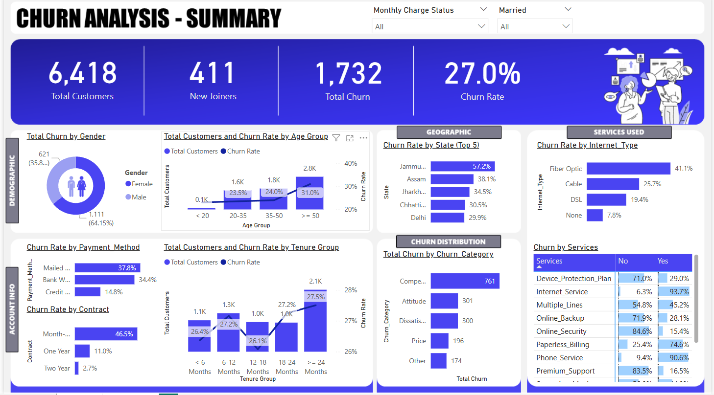

# **Customer Churn Summary Dashboard**  

## **📌 Project Overview**  
This project focuses on analyzing customer churn trends using **Power BI**. The goal is to explore customer data, identify key factors influencing churn, and provide actionable insights through an interactive dashboard.  

## **🔹 Key Features**  
- **Data Preparation:** Extracted and cleaned customer data using **SQL** for accurate analysis.  
- **Power BI Dashboard:** Designed an interactive dashboard to visualize **churn trends, customer demographics, and key factors affecting retention**.  
- **Data Insights:** Analyzed the relationships between **customer tenure, credit score, account activity, and churn probability**.  
- **Filters & Drill-downs:** Enabled dynamic filtering to explore data by geography, age, and other customer attributes.  

## **🛠️ Technologies Used**  
- **SQL** (Data Extraction & Transformation)  
- **Power BI** (Dashboard & Data Visualization)  
- **Excel** (Data preprocessing)  

## **📊 Dashboard Preview**  
  

## **🚀 How to Use the Dashboard**  
1. Open the **Power BI file (.pbix)** in Power BI Desktop.  
2. Load the dataset.  
3. Interact with filters and visualizations to explore customer churn patterns.  

